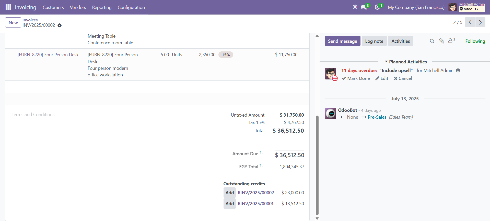
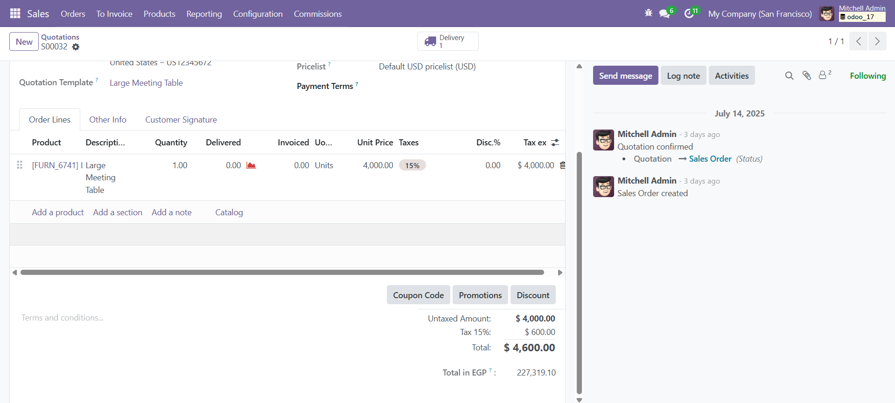

# 💵 USD to EGP Converter for Odoo

This custom Odoo module automatically converts total amounts in USD into EGP using real-time exchange rates.

---

## 🚀 Features

- 🔁 Auto-converts total amounts from USD to EGP on:
  - Sale Orders (`sale.order`)
  - Customer Invoices (`account.move`)
- 🌍 Live exchange rate fetched via external API.
- 📦 Adds a **read-only field** showing the total in EGP.
- 🧪 Error handling for failed API requests.

---

## 🖼️ Screenshots

### 🧾 Invoice Total in EGP  


### 📑 Sale Order Total in EGP  


---

## 🛠️ Installation

1. Copy the module into your Odoo `custom/addons` directory.
2. Update the app list:
   ```
   ./odoo-bin -u usd_to_egp_converter -d your_db_name
   ```
3. Activate the developer mode.
4. Check:
   - **Accounting > Invoices** → `Total in EGP` field.
   - **Sales > Orders** → `Total in EGP` field.

---

## 📁 File Structure

```
usd_to_egp_converter/
├── __init__.py
├── __manifest__.py
├── models/
│   └── sale_order.py
│   └── account_move.py
│   └── currency_api.py
├── views/
│   └── sale_order_view.xml
│   └── account_move_view.xml
```
